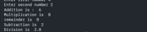
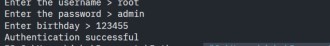

# Python Fundamentals & Conditional Logic

This section covers the first part of my Python training. I started with the basics of running Python code and worked through variables, data types, strings, operators, user input, type casting, and conditional logic.

I also completed two guided exercises that brought several of those concepts together: a simple calculator and an authentication system.

## What I Covered

- Running a Python file and checking output in the terminal
- `print()` and comments
- Variables and basic data types
- Strings and common string methods
- String formatting with f-strings
- Arithmetic, comparison, and logical operators
- User input with `input()`
- Type casting between strings and numeric values
- Conditional logic with `if`, `elif`, and `else`
- Combining conditions with `and`, `or`, and `not`

## Simple Calculator

The calculator was the first exercise where several of the earlier concepts started working together instead of being practiced one at a time.

It asks for two numbers, converts the input into integers, performs several arithmetic operations, and prints the results.

Concepts used:

- variables
- user input
- type casting
- arithmetic operators
- terminal output

[`simple_calculator.py`](simple_calculator.py)

## Authentication System

The authentication exercise introduced conditional logic in a more practical way. The program takes user-entered values and compares them against expected values before deciding which output to return.

The guided version started with a username and password check. I then modified the exercise by adding a third input called `birthday` and an additional failure message. I also updated the condition so the third input is validated along with the username and password.

Concepts used:

- user input
- variables
- comparison operators
- logical `and`
- conditional logic
- multiple output paths

[`authentication_system.py`](authentication_system.py)

## What I Learned

One of the things that clicked for me in this section was how Python handles user input. `input()` returns text, so when I expected a number I had to convert it before using it in a calculation. That became clear while building the calculator.

I also started to see how individual concepts connect. Variables store the values, operators work with them, and conditional statements let the program make a decision instead of always returning the same result.

String methods and f-strings were also useful because they made it easier to work with text and produce cleaner output.

## What Felt New

I used Zed for this training, which was new for me compared with VS Code. I liked that it felt lightweight, and I spent some time looking through the available themes and extensions while setting up the environment.

The bigger change was moving from a basic `Hello World` program to scripts that accept input and react to what the user enters.

## Why It Mattered

These are beginner exercises, but they introduced the basic building blocks I will need for larger scripts later.

A security or automation script still needs to read or accept data, store values, compare information, make decisions, and return useful output. This section gave me hands-on practice with those pieces before moving into loops, functions, file handling, APIs, and security-focused scripting.

## Training Note

These exercises were completed as part of a guided beginner Python course. I am documenting them to show my learning progression and hands-on practice. They are not presented as original standalone software projects.
