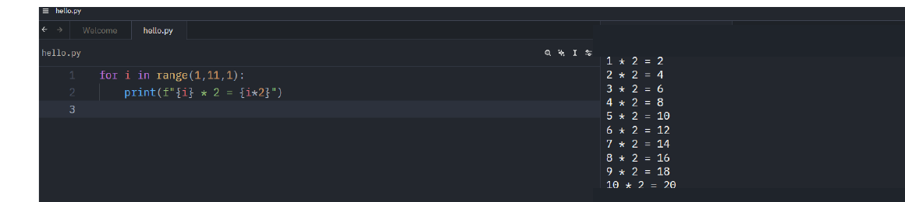
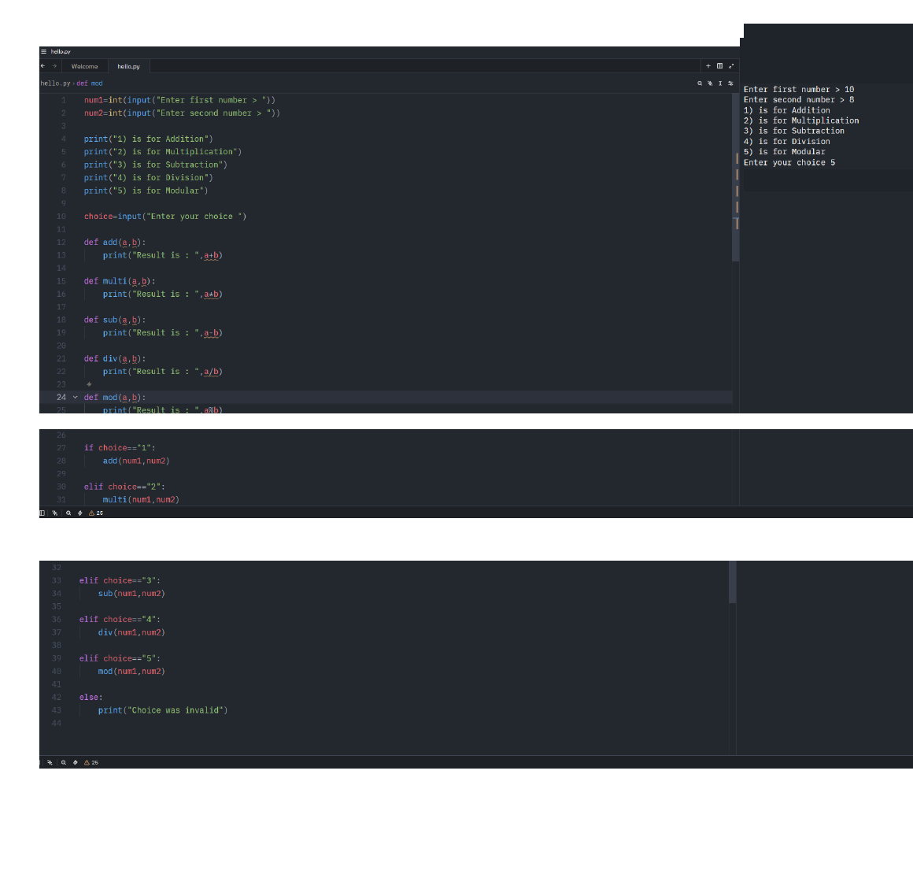

# Loops & Functions

This section moved beyond one-time statements and into code that can repeat work and be reused.

The two areas that stood out most to me were loops and functions. Loops started to make more sense once I used one to build a multiplication table. Functions made it easier to see how a larger script can be broken into smaller pieces instead of repeating the same logic.

## What I Covered

- `for` loops
- `range()`
- `break` and `continue`
- `while` loops
- defining and calling functions
- parameters and arguments
- local and global scope
- return values
- combining functions with user input and conditional logic

## Working with Loops

I started with `for` loops and `range()`.

One thing I found useful was learning that the stop value in `range()` is not included. For example, `range(1, 11)` produces the values 1 through 10.

I also learned that `range()` does not always need all three arguments. The start value defaults to `0`, and the step defaults to `1` when they are not provided.

The multiplication-table example was where loops started to click for me because I could see how one small block of code could generate a larger amount of output.

[`loop_examples.py`](loop_examples.py)

### Loop Control

I practiced two ways to change the normal flow of a loop:

- `break` exits the current loop.
- `continue` skips the rest of the current iteration and moves to the next one.

Indentation became even more important here because moving a statement in or out of the loop block changes when it executes.

I also practiced `while` loops. Unlike a `for` loop that iterates over values from an iterable such as `range()`, a `while` loop keeps running while its condition remains true. When I used a counter with a `while` loop, I had to update that counter myself.

## Functions

Functions were the other major part of this section.

The two biggest benefits I took away were **reusability** and **organization**. A function can be given one job and then called again instead of rewriting the same logic.

I used `def` to define functions and practiced passing values into them.

The terminology also became clearer:

- A **parameter** is the name used in the function definition.
- An **argument** is the actual value passed when the function is called.

[`function_return_example.py`](function_return_example.py)

### Return Values

I also practiced using `return`.

A returned value can be stored in a variable or used elsewhere in the program. Once Python reaches a `return` statement during that function call, the function exits and statements after that return are not executed.

Another detail I learned is that defining a function does not run its body. The function body runs when the function is called. If a function is called without an explicit `return`, Python returns `None`.

## Variable Scope

I practiced the difference between local and global scope.

A variable created inside a function is normally local to that function. A variable created at the module level can be read from functions, although assigning to that same module-level name from inside a function requires the `global` keyword.

I also learned that using `global` should be a deliberate choice rather than a default. Keeping values local when possible makes it easier to understand where they are being changed.

## Function-Based Calculator

The main guided project in this section was a calculator that combined several concepts I had already practiced.

The program:

1. asks the user for two numbers
2. displays a menu of operations
3. stores the user's menu choice
4. uses a separate function for each calculation
5. uses conditional logic to call the correct function
6. returns an invalid-choice message if the menu selection does not match an available option

Because `input()` returns a string, the menu choices are compared against string values such as `"1"` and `"2"`.

### My Change

The guided calculator included addition, multiplication, subtraction, and division.

I added a fifth option myself using the **modulus operator (`%`)**. That required adding another menu choice, another function, and another conditional branch.

[`function_calculator.py`](function_calculator.py)

## What I Learned

Loops were the first part of this section where I could really see how Python can automate repetitive work. The multiplication table made that clear because the same calculation and output format could be repeated without writing ten separate statements.

Functions gave me a similar realization from a different direction. Instead of repeating a block of logic every time I need it, I can define it once and call it with different arguments.

The calculator was useful because it combined user input, type casting, conditional logic, functions, and a change I added myself.

## Why It Mattered

Loops and functions are basic concepts, but they are also directly connected to the kind of scripting I want to build toward.

A security script may need to process many log entries, repeat the same check across a set of records, or perform the same action on different pieces of data. Loops provide the repetition, while functions make the logic easier to organize and reuse.

This section gave me a better foundation for moving into data structures, file handling, APIs, and security-focused automation later in the course.

## Training Note

These exercises were completed as part of a guided beginner Python course. I am documenting them to show my learning progression and hands-on practice.

The modulus option in the function-based calculator was an additional change I made to the guided exercise.
